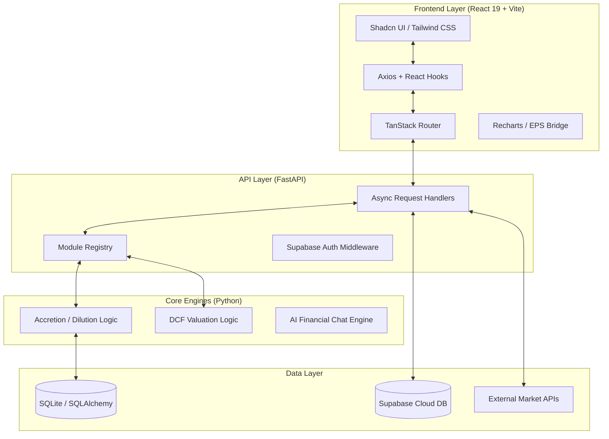
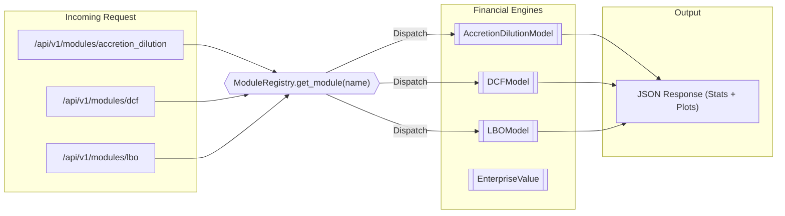
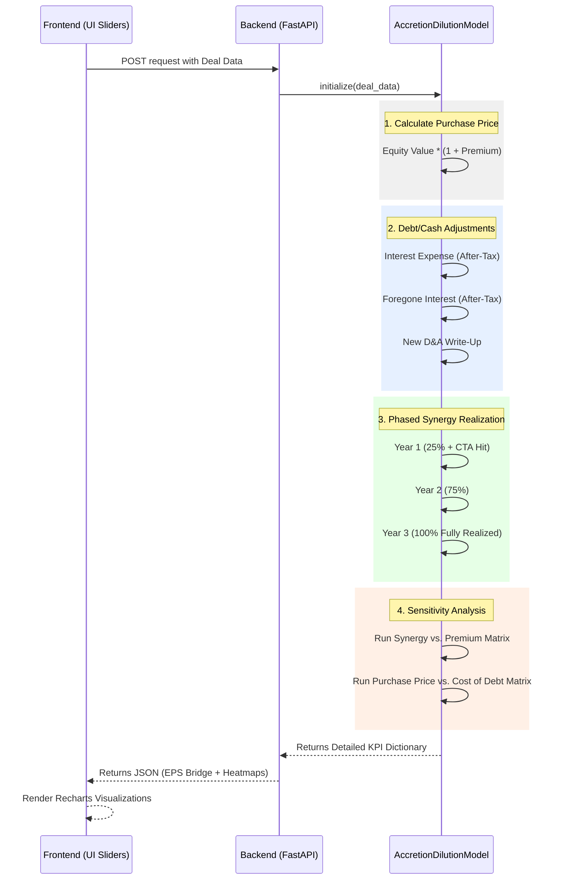

# Modular Financial Platform - Suite Edition

Welcome to the Modular Financial Platform. This application is a high-fidelity, interactive suite designed for investment banking and corporate finance professionals. It provides robust engines for financial analysis, specifically focusing on **Accretion / Dilution (Merger Analysis)** and **Discounted Cash Flow (DCF)** valuations.

Built with a modern tech stack (FastAPI backend + React/Vite frontend), the platform emphasizes speed, accuracy, and enterprise-grade UI/UX using Shadcn UI.

---

## 🌟 Financial Engines

### 1. Merger Analysis (Accretion / Dilution Engine)

The Merger Analysis module allows users to dynamically simulate M&A transactions and instantly view the impact on the acquirer's Earnings Per Share (EPS).

* **Dynamic Deal Structuring:** Input targeted and acquirer financials (Net Income, Shares Outstanding, Share Price).
* **Flexible Consideration Mix:** Define the deal funding mix (Cash, Stock, Debt) with real-time validation ensuring it sums to 100%.
* **Advanced Mechanics:** Incorporate offer premiums, pre-tax synergies, cost to achieve (Year 1 hit), new D&A write-ups, interest rates on new debt, cost of cash, and tax rates.
* **Live Intelligence Center:**
  * **EPS Bridge (Waterfall Chart):** Visually bridges Standalone EPS to Pro-Forma EPS, highlighting the A/D impact.
  * **Contribution Analysis:** Compares Net Income contribution vs. Pro-Forma Equity Ownership between the Acquirer and Target.
  * **Interactive Breakeven Finder:** A slider tool to dynamically find the exact dollar amount of synergies required to break even (0% Accretion).
  * **Sensitivity Matrices:** Auto-generated heatmaps demonstrating A/D impact across varying Premium vs. Synergy realizations, and Purchase Price vs. Cost of Debt.
* **Quick Target Import:** Fetch live or structural data for a target company via Ticker symbol.
* **CSV Drag & Drop:** Rapidly load deal assumptions by dropping a CSV file directly onto the input card.

### 2. Discounted Cash Flow (DCF) Valuation

A rigorous DCF engine designed to calculate the intrinsic value of a company based on projected free cash flows.

* ***Note:*** *The DCF module integrates directly with the backend's `app.core.dcf_logic` and endpoint `/api/v1/modules/dcf/calculate` to process WACC, terminal growth rates, and cash flow projections.*

---

## 🛠️ Built-in Application Features (Shadcn Admin)

This application is built on top of a powerful Admin Dashboard template, offering a suite of pre-built, production-ready features crucial for managing a financial platform:

* **User Management:** Dedicated pages for managing users, roles, and permissions within the platform.
* **Tasks & Workflows:** Built-in task tracking and kanban/list workflows.
* **Settings Suite:** Comprehensive settings pages covering Profile, Account, Appearance, Notifications, and Display preferences.
* **Authentication Hub:** Pre-configured auth pages (Sign-in, Sign-up, Forgot Password, OTP) with partial Clerk integration out-of-the-box.
* **Communications:** Pre-built chat interface mockups for team collaboration.
* **Global Command Search:** A `Cmd+K` global search interface to quickly navigate between financial models, settings, and users.
* **Responsive & Accessible Layout:**
  * Built-in collapsible Sidebar component.
  * Seamless Light / Dark Mode toggling depending on user preference.
  * RTL (Right-to-Left) language support capability.
* **Robust Error Handling:** Custom 401 (Unauthorized), 403 (Forbidden), 404 (Not Found), 500 (Server Error), and 503 (Maintenance) pages.

---

---

## 🏗️ System Architecture & Visualization

### 1. High-Level Technical Stack

The platform utilizes a modern, reactive stack designed for real-time financial modeling and high-fidelity data visualization.



### 2. Module Registry & Dynamic Dispatch

The `ModuleRegistry` allows the platform to scale horizontally by plugging in new financial engines (e.g., LBO, Comps) without restructuring the API.



### 3. Financial Logic Execution Flow (A/D Model)

This detailed sequence shows the cascading calculations performed by the `AccretionDilutionModel` core.



## 🚀 Getting Started

### Prerequisites

* Node.js & `pnpm` (for frontend)
* Python 3.9+ (for backend)

### 1. Start the Backend

```bash
cd backend
pip install -r requirements.txt # (or install dependencies as required)
uvicorn main:app --reload
```

*The backend runs on `http://127.0.0.1:8000`*

### 2. Start the Frontend

```bash
cd frontend
pnpm install
pnpm run dev
```

*The frontend typically runs on `http://localhost:5173` (or 5174 if port is in use).*

---

## 📈 Financial Math Overview

For those interested in the calculation mechanics within the Accretion / Dilution model:

1. **Purchase Price:** `(Target Shares * Target Share Price) * (1 + Offer Premium)`
2. **Funding:** Split Purchase Price by `% Cash`, `% Stock`, `% Debt`.
3. **New Shares Issued:** `Stock Funding / Acquirer Share Price`
4. **Base Income Adjustments:**
    * *Interest Expense:* `Debt Funding * Interest Rate * (1 - Tax Rate)`
    * *Foregone Interest:* `Cash Funding * Cost of Cash * (1 - Tax Rate)`
5. **Pro-Forma Net Income:** `Acquirer NI + Target NI + After-Tax Synergies - Adjustments`
6. **Pro-Forma EPS:** `Pro-Forma Net Income / (Acquirer Shares + New Shares Issued)`

*Synergies are phased aggressively (Y1: 25%, Y2: 75%, Y3: 100%) with Year 3 representing the "Main" Accretion/Dilution metric in the dashboard.*

-- DB Password: QuantEdge@2026!
